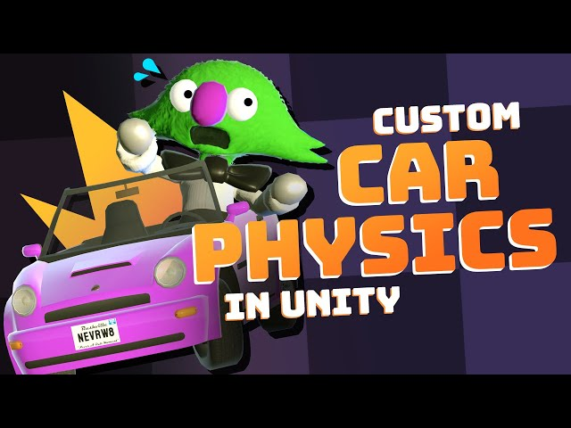

## 🔧 Toyful Games – Custom Car Physics Demo (Very Very Valet)

A demonstration of fully **custom car physics in Unity** inspired by the game *Very Very Valet*. This tutorial showcases how to build a simple yet responsive vehicle controller without using `WheelColliders`—perfect for stylized or arcade-style gameplay.

### 🔗 Reference
- 🎥 [YouTube Demo](https://www.youtube.com/watch?v=CdPYlj5uZeI)

- Other Interesting Video By Toyful Games
- [Springs](https://www.youtube.com/watch?v=bFOAipGJGA0)
- [Physics Based Character Controller](https://www.youtube.com/watch?v=qdskE8PJy6Q)

### ✨ Features
- **Rigidbody + Raycast Setup** – Uses only a Rigidbody and four raycast-based suspension points
- **Custom Suspension** – Spring force implementation to simulate realistic bounce and weight support
- **Custom Steering** – Calculates tire direction and applies lateral friction to prevent side slipping
- **Acceleration & Braking** – Force-based driving with acceleration curves to simulate torque falloff at high speed
- **No WheelColliders** – Fully custom, lightweight approach for better control and stylization

> While no full code is provided, the video clearly explains the fundamentals of building a custom car physics system from the ground up.

