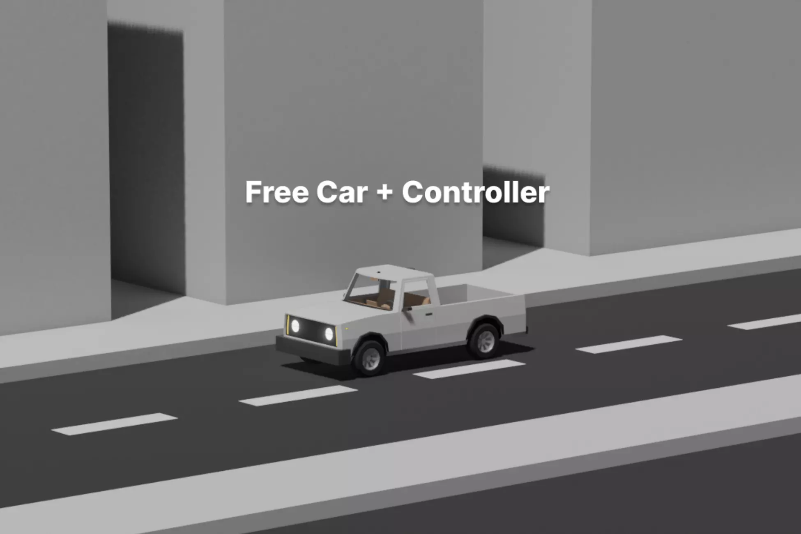

## 🔧 Ezereal – Car Controller (URP Only)

A feature-rich and modular **electric truck car controller** for Unity, built using WheelColliders and designed for quick integration. Includes a professionally modeled 3D vehicle with working interior, customizable systems, and a URP demo scene.

### 🔗 Reference
- 🛒 [Unity Asset Store](https://assetstore.unity.com/packages/tools/physics/ezereal-car-controller-302577)

### ✨ Features
- 🚗 **Modular Electric Vehicle** – Fully modeled with detachable parts and interactive interior (steering, pedals, lights)
- 🎮 **Custom Car Controller** – Modular systems: physics, light control, camera, sounds, suspension bump detection
- ⚙️ **Physics (WheelCollider-based)** – Adjustable power, steering angle, braking, drive types (FWD, RWD, AWD)
- 🎥 **Camera Modes** – Integrated Cinemachine-based views: cockpit, chase, wheel, freelook
- 🧠 **Input System Ready** – Supports Unity's new Input System (1.1.1+)
- 📦 **Easy Integration** – Drag-and-drop prefab setup, no textures, customizable materials
- 🧪 **Includes URP Demo Scene**

### 📦 Requirements
- Input System (v1.1.1+)
- Cinemachine (v3.1.2+)
- TextMeshPro (TMP Essentials)

> A great choice for developers looking to quickly prototype or study realistic car physics and modular vehicle systems.

