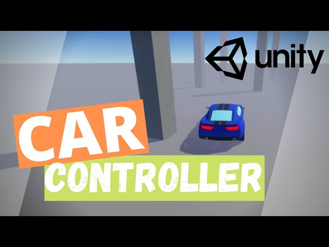

## 🔧 GameDevChef – Simple WheelCollider Car Controller

A beginner-friendly tutorial for creating a **Unity WheelCollider-based car controller**. This guide walks through a basic setup using `motorTorque` and `brakeTorque` for realistic car movement, complete with custom camera.

### 🔗 References
- 🎥 [YouTube Tutorial](https://www.youtube.com/watch?v=Z4HA8zJhGEk)  
- 💾 [GitHub – Full Project](https://github.com/GameDevChef/CarController)

### ✨ Features
- **WheelCollider Movement** – Uses `motorTorque` for acceleration and `brakeTorque` for braking
- **Follow Camera** – Smooth, custom third-person camera system
- **Full Unity Project** – Complete and ready-to-run project provided via GitHub

> Ideal for newcomers looking to explore Unity’s built-in vehicle physics with WheelColliders.

### 🧪 Test Feedback

- Under heavy acceleration, attempting to turn the vehicle causes **uncontrollable sliding**.
- The car behaves as if it's drifting unintentionally—losing grip and being difficult to stop.
- This is likely due to **lack of forward friction or slip curve tuning** in the WheelCollider's `forwardFriction` and `sidewaysFriction`.

> ⚠️ This issue is common in basic WheelCollider setups and may require tuning friction curves or applying a traction helper.
