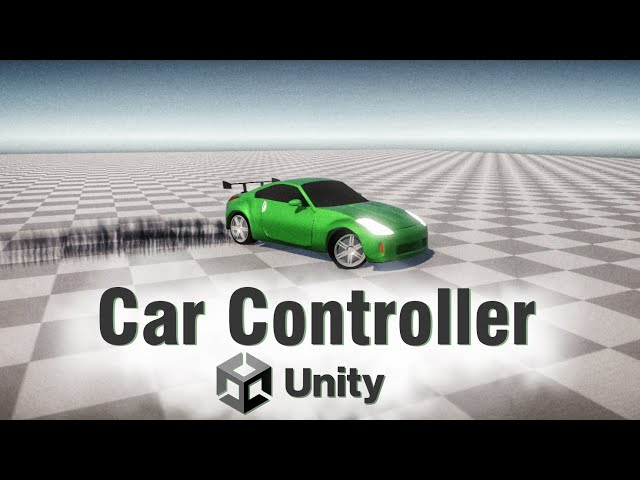

## 🔧 Nanousis Development – Complete Car Racing Game in Unity

A full YouTube tutorial series that walks through building a complete **car racing game in Unity**, starting from a basic car controller using `WheelCollider` and gradually evolving into a fully featured racing system. Each episode includes its own Unity project files for easy follow-along.

### 🔗 References
- 🎥 [YouTube Playlist](https://www.youtube.com/watch?v=gEwNHUDc8uE&list=PL0JXhw1odpJLTRBDdv4ybtYkuD1lEcF-N&index=1)
- 💾 [GitHub – Final Project](https://github.com/Nanousis/NanousisCarController)

### ✨ Features
- **WheelCollider Basics** – Motor power, brake power, slip angles, and steering curve setup
- **Realistic Car Controller** – Gear shifting and RPM-based speed control
- **Mobile UI** – On-screen buttons for throttle, brake, and steering
- **Tire Marks & Drift Effects** – Visual feedback and physics tuning for drifting
- **Drift Scoring System** – Detects and scores player drifting in real-time
- **AI Car Driver Controller** – Intelligent opponents using waypoints and logic
- **Car Parts Manager** – Modular system for toggling car components
- **Lap & Race System** – Full gameplay loop with lap tracking and AI competition

> A fantastic end-to-end learning resource for building a mobile-ready, realistic car racing game in Unity.
> 

